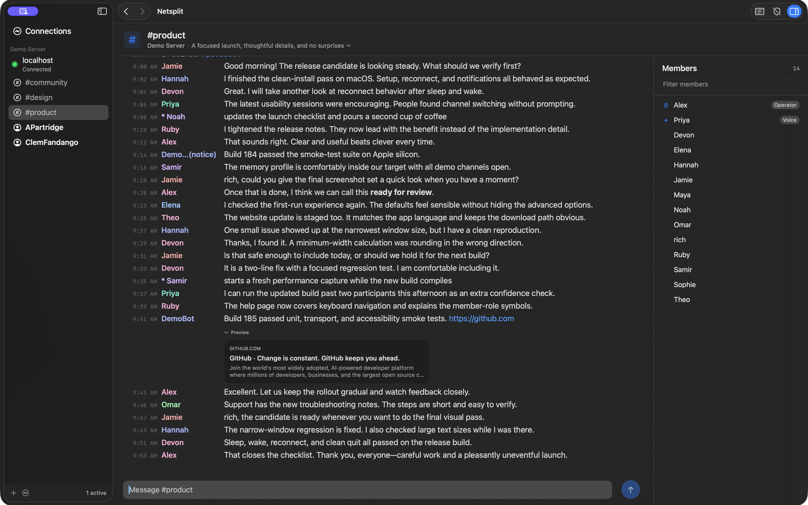

# Overview

During an _uncontrolled bout of nostalgia_, I thought it might be fun to see what the state of IRC is these days.

I couldn't find a macOS client that I liked, so I built this one.

  

It's 100% free and open source. Contributions welcome, throw up a PR (assuming it broadly aligns with the goals below). If changing something graphical, include a screenshot showing what the change is/does. Similarly, feel free to open an issue here for bug reports/feature requests.

## Design Principals

Some thoughts/goals I had while making this.

- macOS Native app - easily installable via the App Store
- Open source - I think thats important for a chat app
- Tasteful (but opinionated) UI, following modern SwiftUI UI/UX guidelines
  - Sixteen themes, including clean light/dark modes, GitHub and Catppuccin variations, Everforest Light, Gruvbox Dark, Lobster, Nord, Rose Pine, Solarized Sepia, Cyberpunk, Greyscale, and a C64-inspired palette :-)
- Generally lightweight. I'm basically just adding features I need/find useful as I go rather than overloading with every possible thing one could do
- Accessibility baked in from day one - the app should work well with Voiceover, etc
- Profiled and optimized for low resource use
  - While connected to 7 active servers / 25 channels, memory footprint remained <150MB
- No telemetry, no phone-home, no ads, no in-app-purchases, no junk
- Secure-by-default, where possible. Prefers TLS. Option to easily connect via an SSH tunnel
  - SSH is nice, as many IRC servers reveal the IP address you're connecting from
- Opt-in, receive-only DCC file sharing, disabled by default
- Client-side ignoring for people, plus persistent muting for channels and direct messages
- I _probably_ won't add scripting, it's not something I find useful, and would add a ton of complexity/increased risk of security issues. That said, there is basic "run these commands on connect" support already

## SSH tunneling

Each server profile can route its IRC connection through an SSH server. Enable
**Connect through an SSH tunnel** while adding or editing a profile, then enter
the SSH host, port, and username. Password authentication and unencrypted
OpenSSH private keys are supported; secrets are stored in the macOS Keychain.
Ed25519 keys are recommended. RSA keys currently work only with SSH servers
that still permit legacy `ssh-rsa` signatures; many modern servers require
RSA-SHA2, so use Ed25519 or password authentication with those servers.

Netsplit learns the SSH host key on the first connection and pins it to that
server profile. A changed key is rejected until you explicitly forget the saved
host identity. IRC TLS, when enabled, remains end-to-end inside the SSH tunnel.

## DCC file receiving

DCC file receiving is disabled by default. Enable **Receive files with DCC** in
the Safety settings to allow incoming offers. Netsplit presents every offer for
confirmation with its sender, filename, size, network endpoint, and connection
route. After acceptance, a separate File Transfers window shows progress,
current download speed, and an option to cancel without blocking the main chat
window. Closing the transfer window does not cancel the download. Accepted files
are saved to Downloads without replacing existing files by default. The Safety
settings can select another persistent download folder or prompt for a folder
after each accepted offer. Downloaded files are marked as internet downloads so
macOS keeps its normal Gatekeeper protections in place.

DCC itself is unencrypted, and a direct transfer can reveal your IP address to
the sender. When the IRC network profile uses an SSH tunnel, Netsplit routes its
DCC connections through the same SSH server. This receive-only implementation
supports active `DCC SEND` offers; passive/reverse offers are not yet supported.

## On-connect commands

Each server profile can run two ordered lists of commands after registration.
The pre-join phase is useful for identifying with NickServ or performing other
account setup before protected channels are joined. The post-join phase runs
after retained and favorite channel join attempts complete, making it suitable
for ChanServ requests, modes, topics, and other channel setup. Client commands
such as `/msg NickServ IDENTIFY ...` and raw IRC commands are both accepted.
Both command lists are stored in the macOS Keychain because they may contain
passwords. Chat messages sent by these commands and their server echoes are
kept out of transcripts. Error replies that identify these messages are
redacted. Editing a profile preserves credentials that could not be read
from Keychain, and a failed save keeps the editor open for retry.

Commands are sent 0.5 seconds apart. Netsplit waits 2 seconds after the final
pre-join command before joining channels. Post-join commands begin after the
server confirms or rejects each automatic join attempt, with a 20-second
fallback for servers that leave a join request unanswered.

## Keyboard shortcuts

Netsplit is designed to be usable without a mouse. These shortcuts are also
listed in the app menus where applicable.

| Shortcut | Action |
| --- | --- |
| `⌘K` | Open the jump palette to search active servers, channels, and direct messages. |
| `⌘1`–`⌘9` | Switch to an active server in sidebar order, restoring its last-open conversation. |
| `⌘[` / `⌘←` | Navigate back through recently viewed conversations. |
| `⌘]` / `⌘→` | Navigate forward through recently viewed conversations. |
| `⌃⌘S` | Move keyboard focus to the server and channel sidebar. |
| `⌃⌘M` | Move keyboard focus to the message field. |
| `⌘L` | Browse channels on the selected server. |
| `⌘W` | Close the current conversation, leave the current channel, or disconnect the selected server. |
| `⌘E` | Show or hide the server and channel sidebar. |
| `⌘B` | Show or hide the channel member list. |
| `⌘+` / `⌘-` | Increase or decrease transcript text size. |
| `⌘0` | Restore the default transcript text size. |

While the jump palette is open, type any part of a server, channel, or nickname;
use `↑` and `↓` to choose a result, `Return` to open it, or `Escape` to close the
palette.

## Development and tests

Open `Netsplit/Netsplit.xcodeproj` and use the shared **Netsplit** scheme. Its
normal **Run** action (Command-R) builds and launches the app. **Test**
(Command-U) runs the focused regression suite using the shared `NetsplitCore`
test plan.

## Supported commands

Commands are entered in the message field with a leading `/`. Netsplit sends
commands to the server associated with the current conversation, so select a
server, channel, or private message first.

### Messaging

| Command | Description |
| --- | --- |
| `/msg <nickname> <message>` | Send a private message. |
| `/query <nickname> <message>` | Send a private message and open that conversation. |
| `/notice <target> <message>` | Send a notice to a nickname or channel. Incoming notices are displayed too. |
| `/me <action>` | Send a CTCP `ACTION` message to the current channel or private message. |
| `/slap <nickname>` | Send the classic trout-slap action to the current channel or private message. |
| `/ping <nickname>` | Ping another user via CTCP and report the round-trip time. |

### Channels and connections

| Command | Description |
| --- | --- |
| `/join <channel> [key]` | Join a channel, optionally using its key. A missing prefix uses the network's preferred channel prefix. Keys stay in memory for reconnects and `/hop` until the conversation is closed. Unanswered attempts time out after 20 seconds so you can retry. |
| `/hop [#channel] [message]` | Leave and immediately rejoin the current channel or a named joined channel, optionally with a part message. |
| `/list [arguments]` | Open the live channel browser and request the server's channel list. |
| `/part [#channel] [reason]` | Leave the current channel, a named joined channel, or include a part reason. |
| `/server <hostname> [port] [--tls\|--no-tls]` | Connect for this session without saving a profile. With no port, the defaults are 6697/TLS or 6667 with `--no-tls`. Explicit port 6697 implies TLS; other explicit ports imply plaintext unless overridden by a flag. |
| `/disconnect [reason]` | Disconnect from the current server. |
| `/quit [reason]` | Disconnect from the current server. |
| `/topic [#channel] [topic]` | View or change a topic. In a channel, a non-channel first argument is treated as the new topic. |

### Identity and information

| Command | Description |
| --- | --- |
| `/nick <nickname>` | Change your nickname. |
| `/whois <nickname>` | Look up a user's IRC information. |
| `/who <channel-or-nickname>` | Request a WHO listing. |
| `/motd [server]` | Request the server's message of the day. |
| `/version [nickname]` | With no nickname, request the server version; with one, request that user's client version via CTCP. |
| `/ctcp <nickname> version` | Alias for a CTCP client-version request. |

### Modes and moderation

These commands require the appropriate server or channel privileges.

| Command | Description |
| --- | --- |
| `/mode <nickname> <flags>` | View or change user modes. |
| `/mode <#channel> <flags> [arguments]` | View or change channel modes. |
| `/op [#channel] <nickname>` | Give channel operator status. Defaults to the current channel. |
| `/deop [#channel] <nickname>` | Remove channel operator status. Defaults to the current channel. |
| `/voice [#channel] <nickname>` | Give voice status. Defaults to the current channel. |
| `/devoice [#channel] <nickname>` | Remove voice status. Defaults to the current channel. |
| `/ban <mask> [#channel] [reason]` | Set a custom ban mask, then kick matching members after the server confirms it. Defaults to the current channel. |
| `/invite <nickname> <#channel>` | Invite a user to a channel. |
| `/kick [#channel] <nickname> [reason]` | Remove a user from a channel. Defaults to the current channel. |
| `/kill <nickname> <reason>` | Disconnect a user from the network (IRC operator only). |

### Local controls

| Command | Description |
| --- | --- |
| `/clear` | Clear the transcript for the selected server, channel, or private message. |
| `/ignore <nickname>` | Hide messages and notices from a nickname on the current network. |
| `/unignore <nickname>` | Restore messages and notices from a nickname on the current network. |
| `/showignores` | List ignored nicknames for the current network. |
| `/mute` | Mute unread highlighting and notifications for the selected channel or direct message. |
| `/unmute` | Restore unread highlighting and notifications for the selected conversation. |
| `/showmutes` | List muted conversations for the current network. |

`/away` and `/names` are also sent directly to the current server. Any other
unrecognised slash command is passed through unchanged, for networks that
support additional IRC commands.
